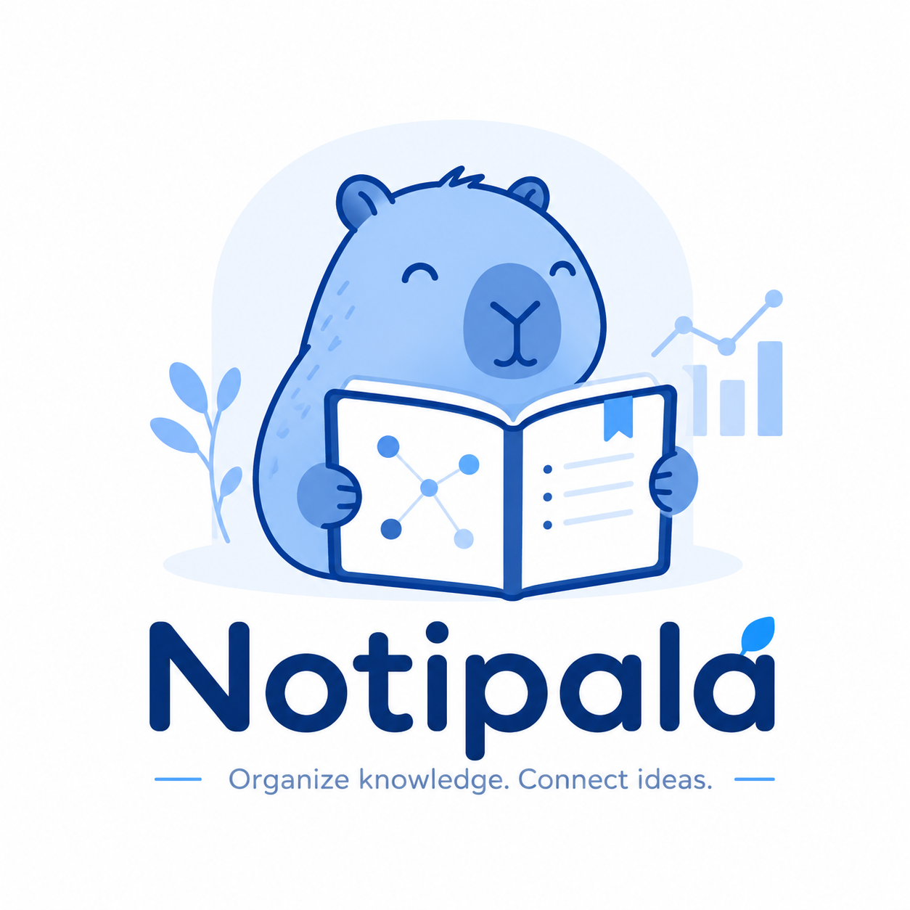
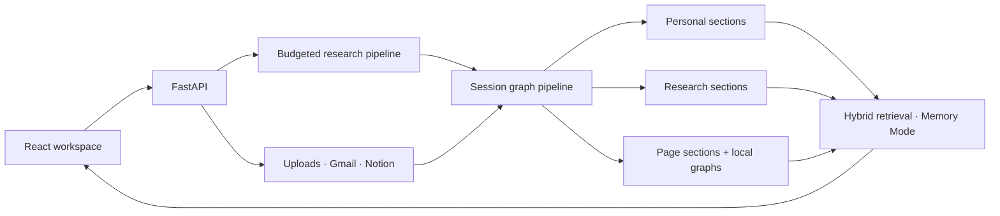

# Notipala

**Organize knowledge. Connect ideas.**

    

[Watch the demo](https://www.youtube.com/watch?v=vcxDGVrb2ko&t=26s) · [Try Notipala](https://notipala.com) 
## Architecture

- **Research:** classify and decompose questions, retrieve and rank evidence, enforce token budgets, then synthesize and evaluate answers.
- **Knowledge maps:** extract sections and relationships with source evidence; update reports and graph artifacts within each session.
- **Hosted execution:** PostgreSQL tracks durable jobs; Cloud Tasks dispatches to Cloud Run workers; GCS stores artifacts.

## Benchmark

| Evaluation | Coverage | Measures |
| --- | --- | --- |
| MemoryBench: LoCoMo, LongMemEval, ConvoMem | Transcript ingestion and memory retrieval | Answer quality, context usage, and retrieval diagnostics |
| HotpotQA runner | Multi-hop research answers and supporting evidence | Answer/supporting-fact EM and F1, joint scores, latency, and token usage |

MemoryBench keeps retrieval closed-book and returns evidence to a separate answering model and judge. Scores depend on the dataset, models, and extraction settings; this README does not claim a validated aggregate result.

## Technology Stack

| Layer | Technologies |
| --- | --- |
| Frontend | React 19, TypeScript, Vite, Tailwind CSS, shadcn/ui |
| Backend | Python, FastAPI, Pydantic |
| Graph and retrieval | ChromaDB, MiniLM embeddings, lexical retrieval |
| Content ingestion | Gmail/Notion APIs, pypdf, Docling/OCR, document parsers |
| Infrastructure | Firebase Auth, PostgreSQL, GCS, Cloud Tasks, Cloud Run |
| Search and models | Brave Search, configurable hosted LLMs and Ollama |

## Key Design Decisions

- **Separate Personal and Research.** Events and personal context remain Personal; reusable knowledge becomes Research. Independent extraction and clustering prevent one domain from overwhelming the other.
- **Preserve source structure.** Gmail messages aggregate by thread. Each Notion page has one global representative and a local Personal/Research graph; a maximum spanning forest organizes display while preserving semantic edges.
- **Link context selectively.** Personal links use semantic, topic, participant, organization, and thread affinity. Source-derived Personal → Research edges remain separate from linker quotas.
- **Keep answers traceable.** Sections retain source evidence; Notion code blocks and structured tables keep their format. Hybrid retrieval combines graph, vector, and lexical signals.
- **Make imports explicit and account-scoped.** OAuth connections are encrypted and isolated per user; users preview and select content before importing.
- **Bound cost and recover work.** Research has explicit evidence/token budgets. Durable jobs support retries, cancellation, and lease-based recovery; unsafe production configuration fails closed.

## Roadmap

- Complete Gmail restricted-scope verification and validate OAuth onboarding with additional accounts.
- Add incremental connector sync, webhook/history updates, and deletion reconciliation.
- Improve extraction coverage, source citation rendering, and page-level retrieval.
- Publish reproducible benchmark results and add product-level graph/import evaluations.
- Add distributed per-user rate limits, dashboards, alerts, recovery runbooks, and load/soak tests.
