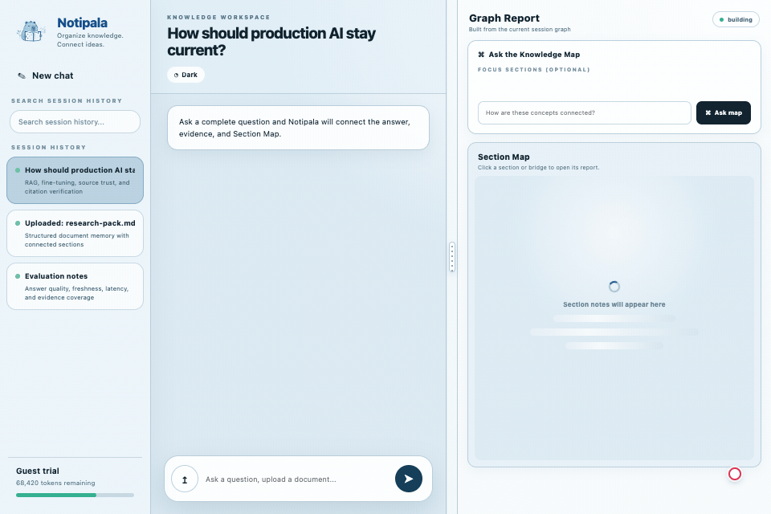
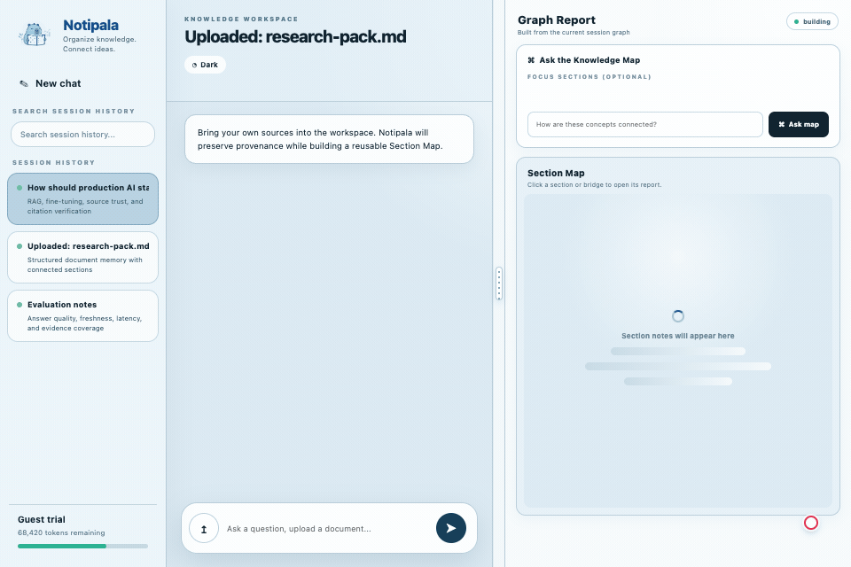
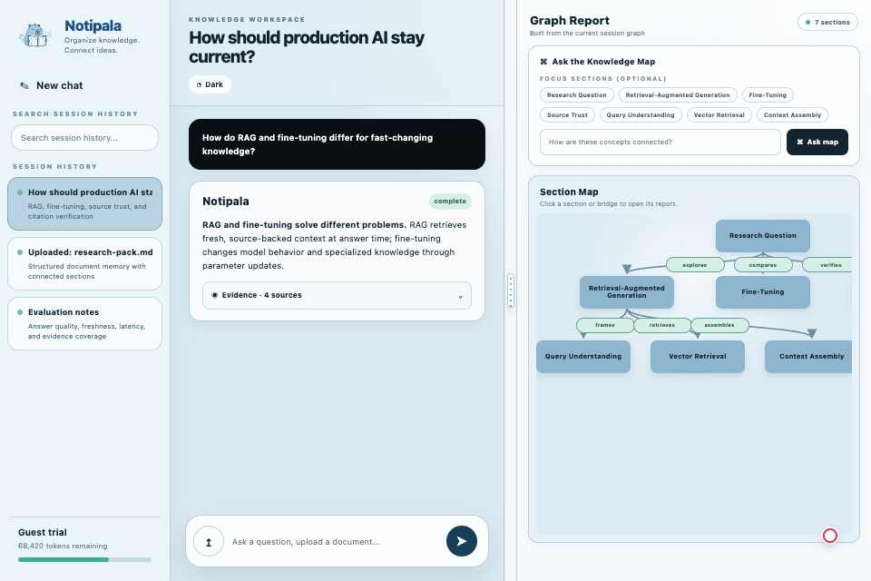
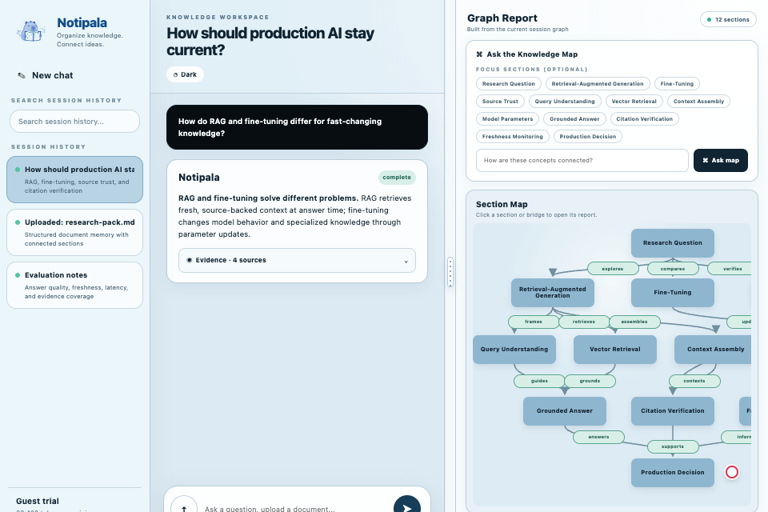
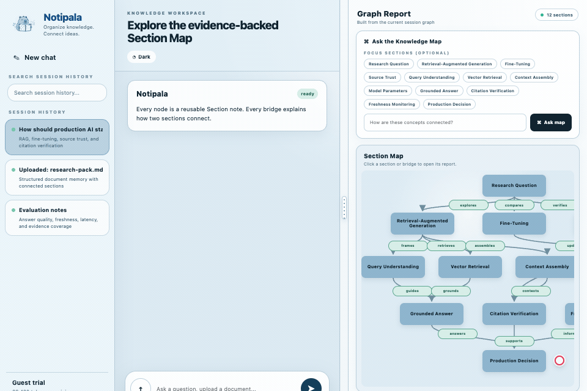

# Notipala — Organize Knowledge

[English](#english) · [繁體中文](#繁體中文) · [简体中文](#简体中文)

---

## English

Notipala turns questions and uploaded files into source-backed answers, then organizes the results into an explorable Section Map.

### 1. Ask a question

Get an answer, inspect its evidence, and watch the Section Map take shape.

### 2. Upload a file

Add your own material and let Notipala convert it into a structured Section Map.

### 3. Ask a follow-up

Continue the conversation while the existing context and Section Map evolve with the new answer.

### 4. Explore in Memory Mode

Ask across saved knowledge, view the reasoning path, and see which sections support the answer.

### 5. Open node and edge details

Select a node to inspect its Section note, or select a bridge to open the related Cross-section note without losing the map context.

---

## 繁體中文

Notipala 將提問與上傳檔案轉化為有來源依據的回答，並把研究結果整理成可探索的 Section Map。

### 1. 提問

取得回答、展開 Evidence，並查看 Section Map 的建立過程。

### 2. 上傳檔案

加入自己的資料，讓 Notipala 將內容整理成結構化的 Section Map。

### 3. 追問

延續同一段對話，保留既有脈絡，並隨新回答更新 Section Map。

### 4. 使用 Memory Mode 探索

從既有知識中提問，查看 Reasoning Path，以及支撐回答的高光 Sections。

### 5. 查看 Node 與 Edge 詳情

點擊 Node 查看 Section note，或點擊 Bridge 開啟對應的 Cross-section note，並可隨時返回完整 Section Map。

---

## 简体中文

Notipala 将提问与上传文件转化为有来源依据的回答，并把研究结果整理成可探索的 Section Map。

### 1. 提问

获取回答、展开 Evidence，并查看 Section Map 的构建过程。

### 2. 上传文件

加入自己的资料，让 Notipala 将内容整理成结构化的 Section Map。

### 3. 追问

延续同一段对话，保留已有上下文，并随新回答更新 Section Map。

### 4. 使用 Memory Mode 探索

从已有知识中提问，查看 Reasoning Path，以及支持回答的高亮 Sections。

### 5. 查看 Node 与 Edge 详情

点击 Node 查看 Section note，或点击 Bridge 打开对应的 Cross-section note，并可随时返回完整 Section Map。

